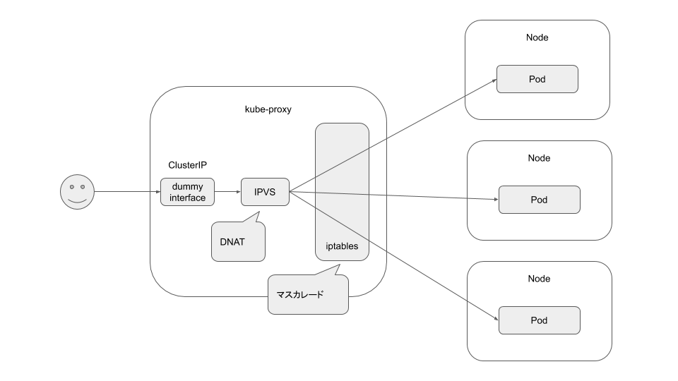
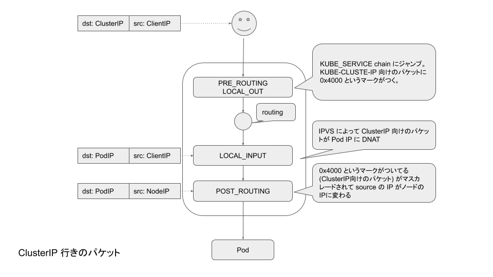

# Service を処理しよう！

冗長化されたアプリケーションは通常、ロードバランサによって処理が分散されます。
Kubernetes における基本的なロードバランサは Service と呼ばれています。

## この章で学ぶこと

-   Service とは
-   ワーカノードは Service からどのようにロードバランサを設定しているのか

## 解説

### Service

-   (Serviceの適当な説明をしてください、ラベルとかセレクタとか

### kube-proxy

Z社では、Pod network はトラディショナルな方法を採用しているが、Service networkに関しては先進的な IPVS mode を採用している。

-   kube-proxy はクラスタ内にて Service で宣言されている L4 ロードバランサを各ノードでセットアップするコンポーネント
-   ipvs mode の場合は、その実装に ipvs を利用する



### Service network

IPVS modeではパケットのロードバランシングは主に IPVS によって処理されているが、Kubernetes の要件的に必要なマスカレードの処理などを (inajobに詳細は説明済み) iptables を利用して処理している。そのため、IPVS mode で必要となる iptables のレコードを Service を処理する前にセットアップしておく必要がある。



もちろん、これらのセットアップは kube-proxy が行う。

## Endpoint Controller @master01 node で作業

Pod が二つできたけど、それぞれのIPに直接アクセスするのは不便。
VIPなものがあっていい感じにロードバランシングして欲しい。それがServiceオブジェクト。
まとめてほしい Pod をラベルセレクターで指定してやる。

マネージャーの私はユーザが Service を作るのを待って、それを承認して、下々に作業を任せる。

```bash
kubectl get service -o wide
```

`web-service` という名前の Service が確認できます。
Selector から先ほど作った ReplicaSet をまとめる Service であることが伺えます。

```bash
kubectl get service web-service -o yaml
```

これを見るだけですと、10.254.10.128 という VIP で Service を作って欲しいということがわかるだけで、
実際にどの IP アドレスがこの Service に紐づいているのかわかりません。
そこで、私はコントローラマネージャの責務として、
ラベルで関連づいているPodからそのIPアドレスをこのサービスのEndpointとして登録する、ということをやってあげます。

まず、ラベルに関連するPodとそのIPアドレスを取得します。

```
kubectl get pod -l app=web -o wide
```

そして、このアドレスをもとに Endpoint オブジェクトを作成します。

```bash
POD_IP1=10.244.2.2
POD_IP2=10.244.1.3
cat <<EOF | kubectl apply -f -
apiVersion: v1
kind: Endpoints
metadata:
  name: web-service
subsets:
- addresses:
  - ip: ${POD_IP1}
    nodeName: yuanying
  - ip: ${POD_IP2}
    nodeName: inajob
  ports:
  - port: 8080
    protocol: TCP
EOF
```

ちゃんとできたか確認します。

```
kubectl get endpoints web-service
```

## kube-proxy としての稲津くん @inajob node で作業

さて、EndpointとServiceはあるけども、実際にそれらのPodにアクセスしなくちゃいけないのは作業者である稲津くんです。
稲津くんは管理者が作った EndpointとServiceの情報を利用して、自分のノードからそれらのServiceに接続できるように設定する必要があります。
これらの設定を行う役割は kube-proxy と呼ばれているようです。

稲津くんはこの設定に IPVS を使っているようです。`ipvsadm` を使うためにrootになります。

```
sudo su
```

### iptables の設定

X社では Service を実現するのに IPVS を使っているので、その事前準備をする必要があります。
しかし、 IPVS 単体ではマスカレードやパケットフィルタリングを実現することができないので、
結局ちゃんと動作するように、iptables の設定をする必要があります。

#### ipset の設定

iptables に service が増えるたびにルールを増やして行くのはアホらしいので、ipset を使います。
まずは事前に利用する set を追加しましょう。

> 今回は nodeport や loadbalancer を使わないので、それらに関連するセットはセットアップしない。

<!-- まずは、コンテナ内からの自身へのヘアピンパケットに対応するためのセットを追加します。

```bash
sudo ipset create KUBE-LOOP-BACK hash:ip,port,ip
``` -->

Service の IP である Cluster IP に対応するためのセットの追加です。
ここには、全てのService IP が入ることになります。

```bash
sudo ipset create KUBE-CLUSTER-IP hash:ip,port
```

#### iptables rule の作成

IPVS mode では dnat しかしないので、その他の filter や masquerade などを処理するために、一部 iptables を利用しているので、その設定を入れる。
このルールは固定で、iptable mode のようにこれ以上増えることはありません。

(今回のデモでは ClusterIP しか処理しないので、それに関連する iptables のルールを追加しています。)

```bash
sudo iptables -t nat -N KUBE-MARK-MASQ
sudo iptables -t nat -A KUBE-MARK-MASQ -j MARK --set-xmark 0x4000/0x4000

sudo iptables -t nat -N KUBE-POSTROUTING
# kubernetes service traffic requiring SNAT
sudo iptables -t nat -A KUBE-POSTROUTING -m comment --comment "kubernetes service traffic requiring SNAT" -m mark --mark 0x4000/0x4000 -j MASQUERADE

sudo iptables -t nat -N KUBE-SERVICES
# Kubernetes service cluster ip + port for masquerade purpose
sudo iptables -t nat -A KUBE-SERVICES ! -s 10.244.0.0/16 -m comment --comment "Kubernetes service cluster ip + port for masquerade purpose" -m set --match-set KUBE-CLUSTER-IP dst,dst -j KUBE-MARK-MASQ
sudo iptables -t nat -A KUBE-SERVICES -m set --match-set KUBE-CLUSTER-IP dst,dst -j ACCEPT

# kubernetes service portals
sudo iptables -t nat -I PREROUTING -m comment --comment "kubernetes service portals" -j KUBE-SERVICES
sudo iptables -t nat -I OUTPUT -m comment --comment "kubernetes service portals" -j KUBE-SERVICES

# kubernetes postrouting rules
sudo iptables -t nat -I POSTROUTING -m comment --comment "kubernetes postrouting rules" -j KUBE-POSTROUTING

sudo iptables -t filter -N KUBE-FORWARD
# kubernetes forwarding rules
sudo iptables -t filter -A KUBE-FORWARD -m comment --comment "kubernetes forwarding rules" -m mark --mark 0x4000/0x4000 -j ACCEPT
# kubernetes forwarding conntrack pod source rule
sudo iptables -t filter -A KUBE-FORWARD -s 10.244.0.0/16 -m comment --comment "kubernetes forwarding conntrack pod source rule" -m conntrack --ctstate RELATED,ESTABLISHED -j ACCEPT
# kubernetes forwarding conntrack pod destination rule
sudo iptables -t filter -A KUBE-FORWARD -d 10.244.0.0/16 -m comment --comment "kubernetes forwarding conntrack pod destination rule" -m conntrack --ctstate RELATED,ESTABLISHED -j ACCEPT
# kubernetes forwarding rules
sudo iptables -t filter -I FORWARD -m comment --comment "kubernetes forwarding rules" -j KUBE-FORWARD
```

### IPVS の初期設定

それでは、IPVSを使うための初期設定をしていきましょう。

#### カーネルモジュールの設定

IPVS が conntrack の dnat の情報を消してしまうので、それを残すために必要。

-   ref: [IPVS (LVS/NAT) とiptables DNAT targetの共存について調べた](https://ntoofu.github.io/blog/post/research-ipvs-and-dnat/)

```bash
echo 1 | sudo tee /proc/sys/net/ipv4/vs/conntrack
```

#### dummy interface の作成

Service のパケットを受ける dummy のインタフェースを作成します。

```bash
sudo ip link add kube-ipvs0 type dummy
```

これで IPVS を使う準備が整いました。それでは、実際に Service のエンドポイントを登録していきます。

### Service を IPVS mode で利用できるように設定

それではまず、IPVS の Virtual Server を設定しましょう。 Virtual Server の VIP は service のアドレスとなります。

```
kubectl get services
```

サービスのアドレスが `10.254.10.128:80` であることがわかりました。それでは Virtual Server を設定しましょう。

その前に、IPVS mode の kube-proxy でも一部の機能で iptables を利用している関係上、
iptables にサービスのアドレスを教える必要があります。

```bash
ipset add KUBE-CLUSTER-IP 10.254.10.128,tcp:80
```

次に、IPVS の設定の一環として、入社時のセットアップで作成した dummy interface にサービスのアドレスを設定します。

```bash
ip addr add 10.254.10.128 dev kube-ipvs0
```

そして、IPVS の Virtual Server そのものを作成します。

```bash
ipvsadm -A -t 10.254.10.128:80 -s rr
```

次に、この Virtual Server に紐づく Real Server を設定します。この場合の Real Server はもちろん Pod なのですが、Kubernetes では Endpoint から作成することになっています。
Endpoint から作成することで外部のサービスを利用することができるなど、色々な柔軟性を得ることができるのですが、今回のデモでは時間がないので説明は省きます。

```
kubectl get endpoints 
```

Endpoint に設定されている二つのアドレスから Real Server を作ります。

```bash
POD_IP1=10.244.2.2
POD_IP2=10.244.1.3
ipvsadm -a -t 10.254.10.128:80 -r ${POD_IP1}:8080 -m
ipvsadm -a -t 10.254.10.128:80 -r ${POD_IP2}:8080 -m
```

さて、ちゃんと設定できたでしょうか？確認しましょう。

```bash
ipvsadm -Ln
```

VIP に対して curl コマンドを実行してみます。

```bash
curl 10.254.10.128
```
